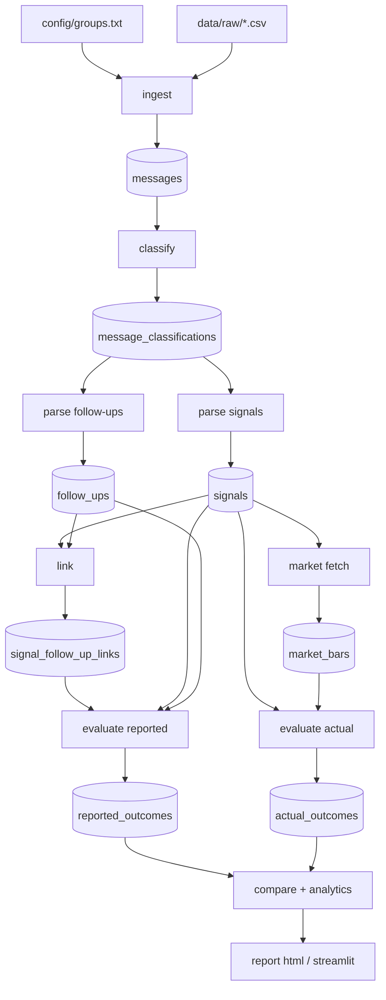

# Signalyze — Architecture

This document captures the runtime architecture, the per-stage I/O contract,
and the cross-cutting design principles. Each stage is independently runnable
and idempotent.

## Pipeline overview



## Per-stage contract

| Stage              | Reads                                              | Writes                              | Key invariants                                                                 |
| ------------------ | -------------------------------------------------- | ----------------------------------- | ------------------------------------------------------------------------------ |
| `ingest backfill`  | `data/raw/*.csv`                                   | `messages` + `groups`               | `(group_id, message_id)` is unique; no overwrite.                              |
| `ingest fetch`     | Telegram via Telethon                              | `messages` + `data/raw/*.parquet`   | Idempotent on `message_id`; resumable.                                         |
| `classify run`     | `messages`                                         | `message_classifications`           | One classification per message; precision on SIGNAL ≥ 0.95.                    |
| `parse signals`    | `messages` (class=SIGNAL or UNCERTAIN)             | `signals`                           | Exactly one `Signal` per `message_uid`; XAUUSD plausibility checks.            |
| `parse follow-ups` | `messages` (class=FOLLOW_UP or UNCERTAIN)          | `follow_ups`                        | Exactly one `FollowUpEvent` per `message_uid`.                                 |
| `link run`         | `signals`, `follow_ups`, `messages.reply_to_msg_id`| `signal_follow_up_links`            | Every link tagged with `link_method` + `link_confidence`.                      |
| `evaluate reported`| `signals`, `follow_ups`, links ≥ `min_confidence`  | `reported_outcomes`                 | One outcome per signal; CANCEL > SL-before-TP > any TP > MANUAL > UPDATE.      |
| `market fetch`     | `signals`                                          | `market_bars`                       | Idempotent; only missing day-slices are fetched. Caches by bar_id.             |
| `evaluate actual`  | `signals`, `market_bars`                           | `actual_outcomes`                   | First-touch semantics; same-bar SL+TP → AMBIGUOUS.                             |
| `compare run`      | `reported_outcomes`, `actual_outcomes`             | `discrepancies` (in-memory + CSV)   | Categorised: REPORTED_WIN_ACTUAL_LOSS, REPORTED_LOSS_ACTUAL_WIN, MATCH, etc.   |
| `report html`      | all of the above                                   | `data/reports/*.html`               | Pure read; never mutates the DB.                                               |

## Module layout (after `src/` migration)

```
src/signalyze/
  domain/          # pydantic v2 frozen models, zero I/O
  storage/
    migrations/    # numbered SQL files; schema_version-controlled
    db.py          # connection + transaction context manager
    repositories.py
    llm_cache.py
  utils/           # time (UTC), money (pips), logging
  llm/             # provider-agnostic client + cost cap + cache
  ingest/          # Telethon fetcher + raw CSV backfill
  classify/        # rules + LLM fallback + runner
  parse/
    signals_rules.py / signals_llm.py / signals_runner.py
    follow_ups_rules.py / follow_ups_llm.py / follow_ups_runner.py
  link/            # tiered linker + LLM tiebreaker + review CSV export
  evaluate/        # reported + actual outcome derivation
  market/
    provider.py    # protocol
    providers/     # twelvedata, csv (offline)
    runner.py      # gap-aware fetcher
  compare/         # reported-vs-actual diff
  analytics/       # win rate, RR, time-to-hit, expectancy
  report/          # Streamlit + HTML
  cli.py           # Typer entry point
```

## Cross-cutting principles

- **Domain-first.** `domain/` is a pure dependency leaf. All other layers
  import *from* domain, never the reverse. There is no circular dependency
  between storage and parsing.
- **Idempotency.** Every stage is safe to re-run. Outputs carry
  `parse_version` / `linker_version` / `computed_version` so a re-run with a
  bumped version is distinguishable from a no-op replay.
- **One-way dataflow.** Stages read from the canonical store and write to a
  new table; nothing rewrites prior outputs in place. This is what makes the
  CSV-export-and-edit workflow safe.
- **Determinism by default.** Rule outputs are pure functions of text. LLM
  outputs are cached on `(model, prompt_version, content_hash)`. Random
  sampling, when needed, is explicit and seeded.
- **Confidence everywhere.** Classifications, parses, and links all carry a
  `confidence` float. Downstream queries can filter on it; nothing silently
  hides uncertainty.
- **Cost discipline.** LLM calls are gated by an environment-level budget
  (`SIGNALYZE_LLM_MAX_USD_PER_RUN`) and only fire below a configurable
  rule-confidence threshold. Cache hits cost zero.

## TP-depth breakdown

A headline reported win rate of "95%" is uninformative on its own when most
groups define 4–5 take-profit levels and any one of them counts as a win.
`signalyze evaluate tp-depth` augments the leaderboard with a per-level view:

- For each group and each TP level `N`, the **denominator** is the number of
  signals that defined at least `N` take-profits *and* received a reported
  outcome other than `NO_REPORT`.
- The **numerator** is the subset of that denominator with
  `reported_outcomes.max_tp_hit >= N`.
- `hit_rate_N = num_N / denom_N` (rendered as `n/a` when `denom_N == 0`).

This means channels that publish fewer TPs are judged fairly on the levels
they actually advertise. The same view is rendered in the HTML report and the
Streamlit dashboard via `signalyze.analytics.iter_tp_depth`.

## How to add a new instrument

1. Add a price range to `instrument.<name>_min_price/max_price` in
   `config/settings.toml`.
2. Extend `signalyze.parse.signals_rules` plausibility checks to dispatch on
   `instrument`.
3. Add a market provider symbol map entry (e.g. `_SYMBOL_MAP["EURUSD"] = "EUR/USD"`).
4. Re-run the full pipeline; everything downstream is instrument-aware.

## How to add a new group format

1. Capture 20–40 example messages from the group into the appropriate
   `tests/fixtures/golden_*.jsonl` file.
2. Either:
   - Extend the deterministic parser (`signals_rules.py` / `follow_ups_rules.py`)
     with a new pattern.
   - Or rely on the LLM fallback — bump the `prompt_version` if you tweak the
     prompt so the cache gets repartitioned cleanly.
3. Re-run `pytest tests/golden` to confirm the threshold still holds.
